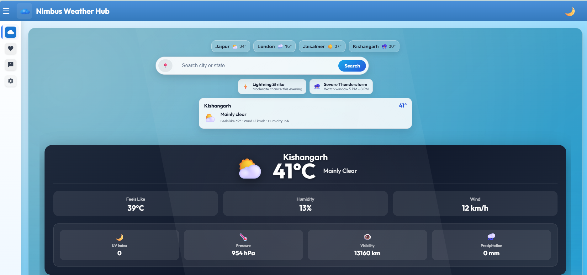

🌦️ Weather App
A modern and responsive Weather Application built using Angular that provides real-time weather updates, forecasts, and alerts for any city.

🚀 Live Demo
https://github.com/shrutisharma63/WeatherApp_Project.git

📌 Features

🌡️ Real-time temperature updates
📍 Detects current location weather
🔍 Search weather by city name
💨 Wind speed, humidity & feels-like temperature
🌙 Clean and responsive UI design
📊 Hourly and daily forecast

🛠️ Tech Stack

⚡ Angular
🟦 TypeScript
🎨 HTML, CSS / SCSS
🌐 Weather API
📡 REST API Integration

⚙️ Installation & Setup

1. Clone the repository
git clone -  https://github.com/shrutisharma63/WeatherApp_Project.git 

2. Navigate to project folder
cd My-Weather-App

3. Install dependencies
npm install

4. Run the project
ng serve

5. Open in browser
http://localhost:4200

📸 Screenshots
